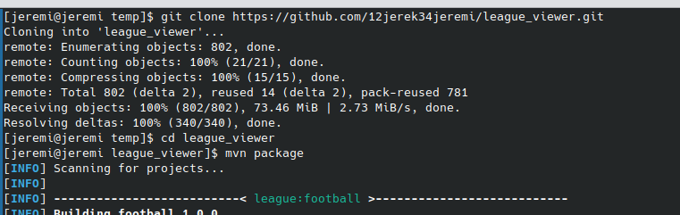
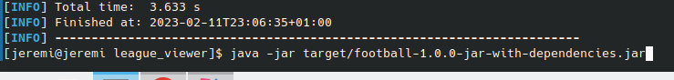
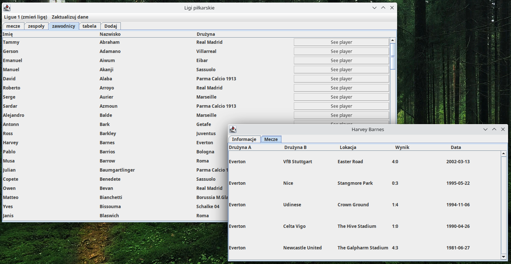
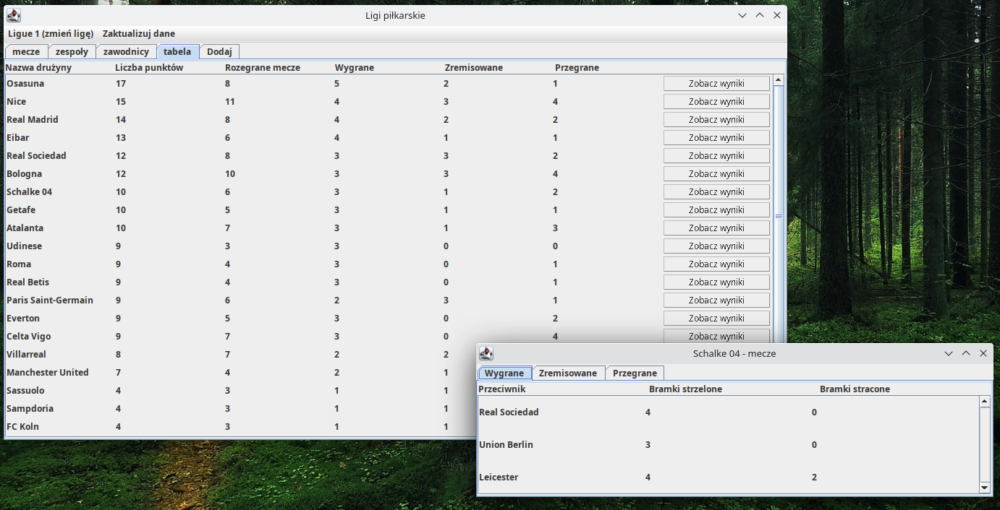
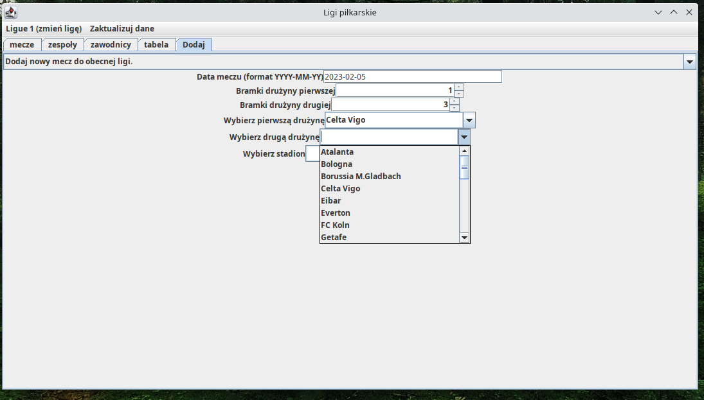
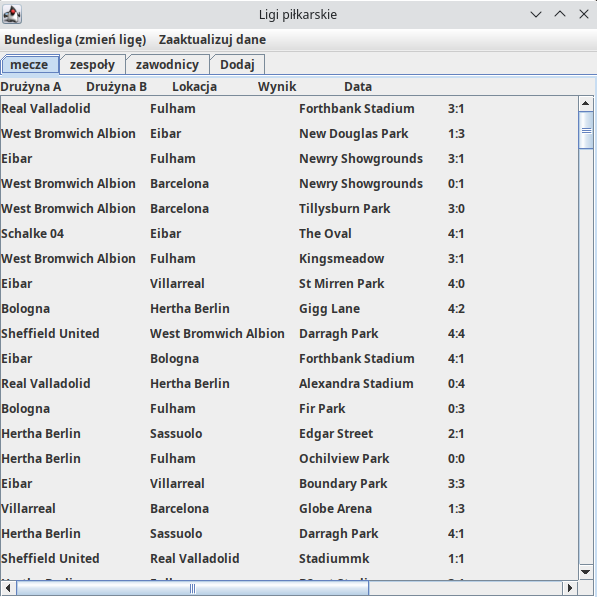

# League Viewer
Aplikacja League Viewer była współtworzona przeze mnie w ramach projektu z Programownia Alikacyjnego na uczelni. W tym pliku README.md znajdziesz [link do video](https://drive.google.com/file/d/1wyUm6_Vz_4pqdqQw1XxXmbbhKgX2G-dE/view?usp=share_link), na którym pokazuje jak aplikacja wygląda i jak można jej używać, [instrukcje skompilowania i uruchomienia aplikacji](#kompilacja-i-uruchomienie), [opis mojej części projektu](#moja-część-projektu), [krótki opis tego na co pozwala aplikacja](#funkcje-aplikacji) oraz, na końcu pliku, [kilka screenów z aplikacji](#kilka-screenów-z-aplikacji). Aplikacja umożliwia użytkownikom przeglądanie informacji związanych z piłką nożną w różnych ligach oraz dodawanie nowych informacji.

Tutaj masz [link do video](https://drive.google.com/file/d/1wyUm6_Vz_4pqdqQw1XxXmbbhKgX2G-dE/view?usp=share_link), na którym pokazuje jak aplikacja wygląda i jak można jej używać.

### Kompilacja i uruchomienie
Aby skompilować i uruchomić aplikacje należy najpierw sklonować repozytorium na zwój komputer i rzejść do nowo utworzonego katalogu.
~~~
git clone https://github.com/12jerek34jeremi/league_viewer.git
cd league_viewer
~~~
Następnie należy użyć komendu `mvn package` do skompilowania aplikacji. Zakładem, że oprogramowania [Maven](https://maven.apache.org/) i [JDK](https://openjdk.org/) są zainstalowane i dodane do ścieżki, a zatem dostępne z terminala:
~~~
 mvn package;
~~~
Po skompilowaniu aplikacji należy użyć poniższej komendy do uruchomienia alikacji. (Maven stworzył plik jar, który teraz wystarczy uruchomić.)
~~~
java -jar target/football-1.0.0-jar-with-dependencies.jar
~~~
 

  
### Moja część projektu
W projekcie odpowiedzialny byłem za:
* warstwę aplikacji pozwalającej na połączenie się z Bazą Danych i pobraniu z niej danych. (Implementacja klas [DataProvider](src/main/java/league/conectivity/DataProvider.java), [DataGetter](src/main/java/league/conectivity/DataGetter.java), [BaseConnector](src/main/java/league/conectivity/BaseConector.java))
* przeniesienie bazy danych z uczelnianego serwera do AMAZON RDS
* stworzenie paneli wyświetlająych liste danych (lista meczy, lista drużyn, itd)
  * implementacja klas  [LeaguePanel](src/main/java/league/panels/LeaguePanel.java), [LeagueViewingPanel](src/main/java/league/panels/LeagueViewingPanel.java)
  * stworzenie klas [MatchesPanel](), [PlayersPanel](), [TeamsPanel]() (Klasy te były potem rozwijane przez posostałych członków zespołu.)
* stworzenie interfejsu graficznego pozwalającego na wprowadzanie nowych danych
  * implementacja klas [AddingPanel](src/main/java/league/panels/AddingPanel.java), [InputsPanel](src/main/java/league/panels/InputsPanel.java)
  
### Funkcje aplikacji
Aplikacja pozwalna między innymi na:
* wyświetlanie listy drużyn grających w danej lidze
* wyświetlanie listy wszystkich zawodników, grających w którejś z drużyn, grających w danej lidze.
* wyświetlanie meczy rozegranych w lidze.
* wyświetlanie informacji o zawodniku - jego imię, nazwisko, data urodzenia, wzrost i waga, dane o drużynie zawodnika.
* przeglądanie meczy, w których brał udział dany zawodnik
* wyświetlanie informacji o danej drużynie
* przeglądanie meczy, w których brała udział dana drużyna
* wyświetlanie listy zawodników grających w danej drużynie
* wyświetlanie informacji o danym meczu
* wyświetlanie zawodników w drużynie oraz informacji o niej
* wyświetlanie tabeli punktowej w ligach (ile dana drużyna przegrała i wygrała meczy)
* utworzenie nowej ligi
* dodanie nowej drużyny do ligi
* dodanie nowego zawodnika do drużyny
* dodanie nowego meczu do ligi
  
### Autorzy
 - Paweł Rogóż
 - Zuzanna Damszel
 - Jędrzej Chmiel
  
### Wykorzystane narzędzia
W ramach realizacji projektu korzystamy z języka Java oraz biblioteki Swing
  
### Kilka screen'ów z aplikacji

