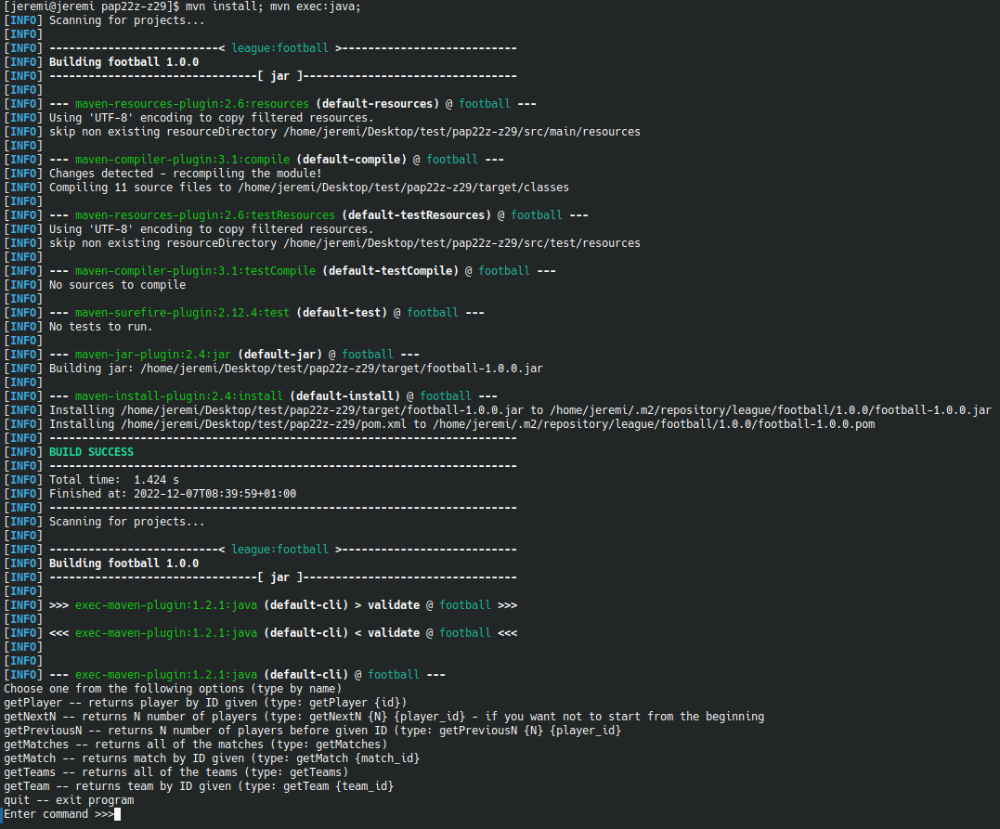
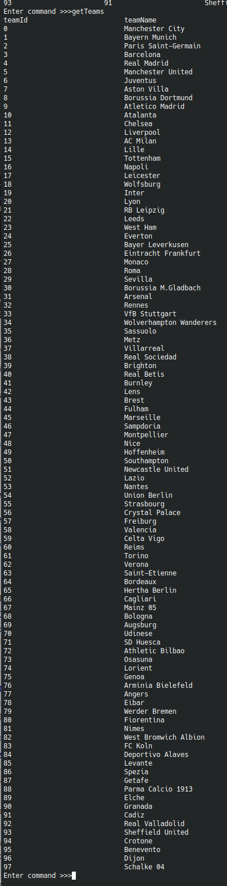

Należy użyć poniższej komendy, aby sklonować to repozytorium na swój komputer

    git clone https://gitlab-stud.elka.pw.edu.pl/jchmiel/pap22z-z29.git
(Należy podać swoją nazwe użytkownika i hasło do serwisu gitlub-stud.elka.pw.edu.pl
Następnie należy przejść do nowo utworzonego katalogu:

    cd pap22z-z29
Następnie należy użyć oprogramowania Maven do skompilowania i uruchomienia aplikacji:

    mvn install; mvn exec:java;
Po uruchomieniu powyższej komendy w konsoli powinny pokazać się komunikaty Maven'a o pomyślnej instalacji i uruchomieniu, oraz instrukcja wyświetlona przez aplikacje.

Teraz można na przykład użyć komendy getTeams, aby wyświetlić nazwy wszystkich drużyn znajdujących się w bazie danych:

    getMatches
Teraz na ekranie powinna wyświetlić się aktualna lista drużyn.

## Autorzy
 - Paweł Rogóż
 - Zuzanna Damszel
 - Jędrzej Chmiel
## Opis projektu / rozwiązywanego problemu
W ramach projektu tworzymy aplikację desktopową umożliwiającą tworzenie i przeprowadzanie lig oraz turniejów piłkarskich w świecie rzeczywistym. Poprzez aplikację użytkownik może zgłosić swoją drużynę do turniejów, na które w danym momencie prowadzone są zapisy. System rozgrywki ustala terminarz zawodów oraz tworzy tabelę ligi wraz z punktacją poszczególnych zespołów. Kapitanowie zespołów po rozegranym spotkaniu uzupełniają w programie jego wynik oraz ewentualnych strzelców bramek. Po zakończeniu wszystkich meczów aplikacja wskazuje króla strzelców oraz najlepszą drużynę rozgrywek
## Wykorzystane narzędzia
W ramach realizacji naszego projektu korzystamy z języka Java oraz biblioteki Swing
